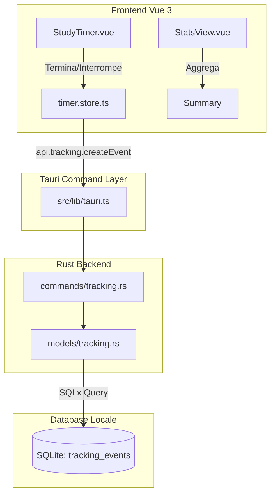

# Architettura del Tracking System

Questo documento descrive il sistema di tracciamento ad eventi estensibili (Event-Driven Tracking System) di StudyTimer, che gestisce le sessioni di studio dell'applicazione.

## Visione Generale

Per superare i limiti di un database relazionale rigido basato su tabelle specifiche per singole metriche, abbiamo introdotto una tabella generica chiamata `tracking_events`. Questo approccio permette di estendere l'applicazione con nuove metriche (es. pause, mood, tempo focalizzato) semplicemente modificando il payload del frontend senza dover alterare le migrazioni SQLite locali.



---

## Schema Tabella SQLite Locale

La tabella `tracking_events` è configurata tramite la migrazione `002_tracking_events.sql`:

```sql
CREATE TABLE IF NOT EXISTS tracking_events (
  id TEXT PRIMARY KEY,               -- UUID dell'evento
  event_type TEXT NOT NULL,          -- Tipo di evento (study_session, cigarette_smoked, ecc.)
  started_at TEXT NOT NULL,          -- Timestamp inizio (ISO 8601 UTC)
  ended_at TEXT,                     -- Timestamp fine (ISO 8601 UTC, opzionale)
  duration_seconds INTEGER,          -- Durata in secondi (opzionale)
  value REAL,                        -- Valore numerico della metrica (es. 1.0 per sigaretta)
  unit TEXT,                         -- Unità di misura (es. 'seconds', 'cigarette')
  source TEXT NOT NULL DEFAULT 'manual', -- Sorgente ('manual', 'automatic')
  note TEXT,                         -- Note personalizzate
  metadata_json TEXT,                -- Dati specifici del tipo di evento in formato JSON
  created_at TEXT NOT NULL,          -- Data di creazione log
  updated_at TEXT NOT NULL,          -- Data ultima modifica log
  deleted_at TEXT,                   -- Timestamp cancellazione soft (se presente)
  synced_at TEXT,                    -- Data ultimo sync cloud
  sync_status TEXT NOT NULL DEFAULT 'pending' -- Stato sync (pending, synced, conflict)
);
```

---

## Struttura degli Eventi Supportati

### 1. Sessione di Studio (`study_session`)
Generato in automatico quando un timer viene completato o interrotto (se la durata supera i 60 secondi).
- **started_at / ended_at**: Timestamp di inizio e fine effettivo.
- **duration_seconds**: Secondi totali trascorsi (effettivi).
- **value**: Equivalente alla durata (in secondi).
- **unit**: `'seconds'`.
- **source**: `'automatic'`.
- **metadata_json**:
  ```json
  {
    "completed": true,   // true se completato, false se interrotto
    "mode": "focus"      // 'focus', 'deep', 'break'
  }
  ```

---

## Aggregazioni ed Elaborazione dei Dati (Rust backend)

Per evitare le discrepanze di fuso orario tipiche dei motori SQL leggeri (come SQLite), le aggregazioni per la dashboard delle statistiche sono elaborate direttamente in **Rust** nel comando `get_tracking_summary`:
1. Viene eseguita una query SQLite lineare filtrata per intervallo temporale `started_at`.
2. Rust itera sugli eventi ed estrae i bucket temporali affettando le stringhe ISO 8601 a seconda della granularità richiesta:
   - **hour**: `[0..13]` (es. `YYYY-MM-DDTHH`)
   - **day**: `[0..10]` (es. `YYYY-MM-DD`)
   - **month**: `[0..7]` (es. `YYYY-MM`)
3. Gli eventi vengono distribuiti in una `HashMap` per calcolare in un unico passaggio streak, medie e valori aggregati, garantendo prestazioni ottimali.
